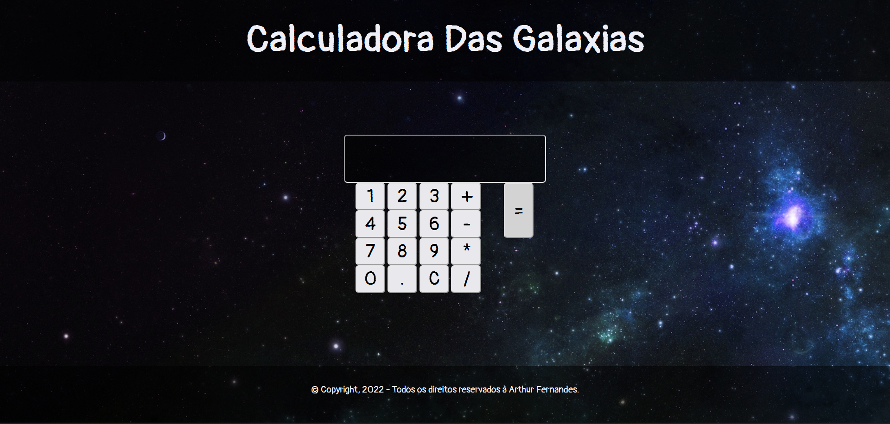

<h1 align ='center'>
    Calculadora Das Galaxias
</h1>

# ⏩Prévia

# 📝 Sobre

Uma calculadora simples na web, desenvolvida no intuito de praticar : HTML5, CSS3 e JavaScript.

# 💻 Tecnologias Usadas

- [HTML5]()
- [CSS3]()
- [JavaScript]()
- [Media Queres]()

# ▶ Como acessar

Acesse esse link : https://github.com/arthurruan01
